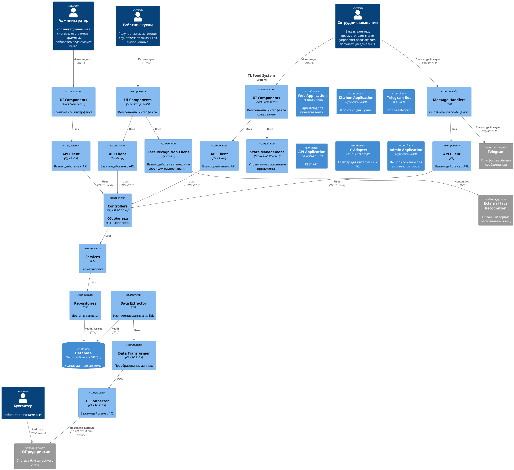

```plantuml
@startuml
!include <c4/C4_Component>

' Внешние пользователи и системы
Person(user, "Сотрудник компании", "Заказывает еду, просматривает меню, управляет автозаказом, получает уведомления.")
Person(cook, "Работник кухни", "Получает заказы, готовит еду, отмечает заказы как выполненные.")
Person(admin, "Администратор", "Управляет данными в системе, настраивает параметры, добавляет/редактирует меню.")
Person(accountant, "Бухгалтер", "Работает с отчетами в 1С")

System_Ext(one_c, "1С:Предприятие", "Система бухгалтерского учета")
System_Ext(telegram, "Telegram", "Платформа обмена сообщениями")
System_Ext(face_recognition_external, "External Face Recognition", "Облачный сервис распознавания лиц")

System_Boundary(c1, "TL Food System") {

    ContainerDb(database, "Database", "Relational Database (MSSQL)", "Хранит данные системы.")

    Container(web_app, "Web Application", "TypeScript, React", "Фронтенд для пользователей.")
        Component(web_app_ui, "UI Components", "React Components", "Компоненты интерфейса пользователя.", web_app)
        Component(web_app_state, "State Management", "Redux/MobX/Context", "Управление состоянием приложения.", web_app)
        Component(web_app_api_client, "API Client", "TypeScript", "Взаимодействие с API.", web_app)
        Rel(web_app_ui, web_app_state, "Uses")
        Rel(web_app_ui, web_app_api_client, "Uses")
        Rel(user, web_app_ui, "Использует", "HTTPS")


    Container(kitchen_app, "Kitchen Application", "TypeScript, React", "Фронтенд для кухни.")
        Component(kitchen_app_ui, "UI Components", "React Components", "Компоненты интерфейса.", kitchen_app)
        Component(kitchen_app_face_client, "Face Recognition Client", "TypeScript", "Взаимодействие с внешним сервисом распознавания.", kitchen_app)
        Component(kitchen_app_api_client, "API Client", "TypeScript", "Взаимодействие с API.", kitchen_app)
        Rel(kitchen_app_ui, kitchen_app_face_client, "Uses")
        Rel(kitchen_app_ui, kitchen_app_api_client, "Uses")
        Rel(cook, kitchen_app_ui, "Использует", "HTTPS")
        Rel(kitchen_app_face_client, face_recognition_external, "Использует", "API")

    Container(tg_bot, "Telegram Bot", "C#, .NET", "Бот для Telegram.")
        Component(tg_bot_handlers, "Message Handlers", "C#", "Обработчики сообщений.", tg_bot)
        Component(tg_bot_api_client, "API Client", "C#", "Взаимодействие с API.", tg_bot)
        Rel(tg_bot_handlers, tg_bot_api_client, "Uses")
        Rel(user, tg_bot_handlers, "Взаимодействует", "Telegram API")
        Rel(tg_bot_handlers, telegram, "Взаимодействует", "Telegram API")

    Container(api, "API Application", "C#, ASP.NET Core", "REST API.")
        Component(api_controllers, "Controllers", "C#, ASP.NET Core", "Обработчики HTTP-запросов.", api)
        Component(api_services, "Services", "C#", "Бизнес-логика.", api)
        Component(api_repositories, "Repositories", "C#", "Доступ к данным.", api)
        Rel(api_controllers, api_services, "Uses")
        Rel(api_services, api_repositories, "Uses")
        Rel(api_repositories, database, "Reads/Writes", "SQL")
        Rel(web_app_api_client, api_controllers, "Uses", "HTTPS, REST")
        Rel(kitchen_app_api_client, api_controllers, "Uses", "HTTPS, REST")
        Rel(tg_bot_api_client, api_controllers, "Uses", "HTTPS, REST")


    Container(adapter_1c, "1C Adapter", "C#, .NET / 1C Script", "Адаптер для интеграции с 1С.")
        Component(adapter_1c_data_extractor, "Data Extractor", "C#", "Извлечение данных из БД.", adapter_1c)
        Component(adapter_1c_data_transformer, "Data Transformer", "C# / 1C Script", "Преобразование данных.", adapter_1c)
        Component(adapter_1c_1c_connector, "1C Connector", "C# / 1C Script", "Взаимодействие с 1С.", adapter_1c)
        Rel(adapter_1c_data_extractor, database, "Reads", "SQL")
        Rel(adapter_1c_data_extractor, adapter_1c_data_transformer, "Uses")
        Rel(adapter_1c_data_transformer, adapter_1c_1c_connector, "Uses")
        Rel(adapter_1c_1c_connector, one_c, "Передает данные", "1C API / COM / Web Services")
        Rel(accountant, one_c, "Работает", "1С Клиент")


    Container(admin_app, "Admin Application", "TypeScript, React", "Веб-приложение для администраторов.")
        Component(admin_app_ui, "UI Components", "React Components", "Компоненты интерфейса.", admin_app)
        Component(admin_app_api_client, "API Client", "TypeScript", "Взаимодействие с API.", admin_app)
        Rel(admin_app_ui, admin_app_api_client, "Uses")
        Rel(admin, admin_app_ui, "Использует", "HTTPS")

        Rel(admin_app_api_client, api_controllers, "Uses","HTTPS, REST")
}
@enduml
```

