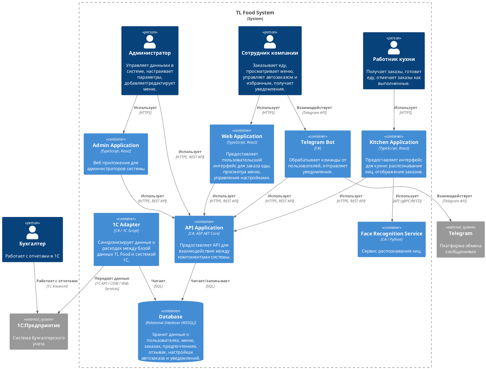

![](https://www.plantuml.com/plantuml/png/fLTTRnj557stvFymk2-E5CMArASAeQPkAX0jkB4b7gtDUaXNTNQjzGQ845ASD5J85OM-W7WWL0ZnQhjnuyJnvY_C_YFElJExtZLhqePARJrVT-uvzyoPsMBXRZUm_61ljrqiVE2uTdkl9SM7zkrAzNQpwhc1vRZI_wXOA1PgqkzwRjcoRMyF_MwmAahgv-WeEbPlr41DeqCrZWvArFi7saCLecU0laCHzGIrekVKGj-bcWWr4klgTMb5Y6AXljyDv6vpyvkWxBcoQIC6nkwea-X0ZTMfkiB_a-WbraxKc7TuZNQFTaIiWL33nJIYdhfG8Nf2WI6pRscbMDYIxGo4UBztoRcaynBgDpMbJDGiEgIO2O1x2Dko_FsolOwfZOVYWUUrX1u4qc-B1O4_XiYzhlGr5Dhc83e2q1d2NWXE_L9TOLVgu7tLBsXTuEzPr5SZaoEH4nsj2YOe16QGGR6mA9booNd-k0eUUDe0GzFefHv40-12THO7fuq5LMU2tqEUFiFolhgaNJ0wPJeDHKU8HVMXRAUq3rLfZIX9uRGzxscMu1Wb5srcy9qi19_d5FMnznjU6MB3IHeuTG9XxYh1Fx3H2FbpxjXiRF2C5zEqMhkEIudy140eDeFfCPi3sjb8-yz_atWw9qdh6eMOgtECB6S8OKAbIuC2SnS180KGJY9pc8vVCMS0I4Z_B9HqOTUq0Wb9SbxlRvTRLc1jMrs9dE-RdvG_v6y5ZkTQRH5tY_AZUltnmnM6zvSf-IGBR0ocu_g_O9MCc9KnPHaThwPabjBIW4UkuaCC3f_p6fO9Zr7vZA2vFISgLESK9JhE4-c099gdFdMUHqVvQxdTj3eT0Fn2RekDJgVjs4m3OMxiTsJTzfqEt61BMdQWvMYo3hcGcNhdq_22BGSPqDcP6HTwXg5pSf9JMYwo44Z3_SpX3RL6bXpQcBaScaXvYQ39uhIvp76hNx51ahYM4E7ykD6erVCeU-e4zXFfckMVwjR_fcuvCuaPt15yudIsPmIL3mmL5og4xqRV6-64ng3UcjgFHSR7HXb2j0jbKRqtAS5ESzkZUwyXstB7jtR5FOynLsynyjzDHaEsuPHFQqCd5AVaI-5I6H4h1jwYprpZjlEg9rcgLqp8X9I5TKmu0e_cI1CS6xLFyW1R7GUpCBXO-UgjLR5Hhwrzjjd0T5zUKtYA45Twb9-KLZO9_orv-_mI3BLh9m-7jBj6_Gp-HEywx_-iBnIxMM_4mEC86O7SE4fSWHi7C9VHUwzFHQ2bgKj0_KsUhlLOuGfSCOs9I2aYhe4y5NnfsRBfIzlRSHqI06O-G1VsIRf4NVfVERRKsX0LKTiFdcYfu8630yy5xYqzsrHxFjjhIwkHayKoPaXkvPsjMhL2vApaAhjbTGBfDzVviLaL6xgTv8ykxMpnSnCAF6R3dV7RA7KHBroJ6YBCZEJD5rXAr4DZJkUfPPWIFnKNvCqJyU9SosfZdlcI0gTgcRSgUVEUS6Nqws8HIidm0Yehelhv8_nBbwUfSpUVKwZMUEi6_Nwt--8LCXZgQt024OHfGpUUCLZs9YFlN724l7EKIknQqy-ilQ4HV9VwAA2lci3uRCfopQDtobV5CyR2dpBq_EFh7mti5_8rzqDiz_mPOZvZOfT91R-9uz-LRWkVV_y0)

