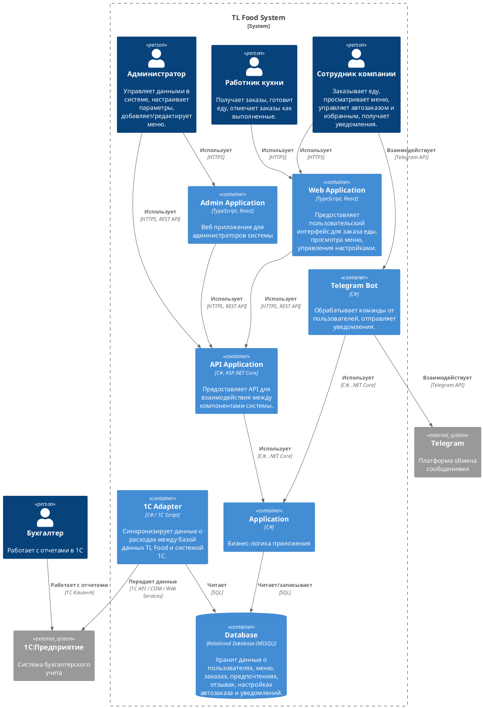

 

```plantuml
@startuml
!include <c4/C4_Container>

Person(accountant, "Бухгалтер", "Работает с отчетами в 1С")  
System_Ext(one_c, "1С:Предприятие", "Система бухгалтерского учета")
Rel(accountant, one_c, "Работает с отчетами", "1С Клиент")

System_Boundary(c1, "TL Food System") {
    Person(user, "Сотрудник компании", "Заказывает еду, просматривает меню, управляет автозаказом и избранным, получает уведомления.")
    Person(cook, "Работник кухни", "Получает заказы, готовит еду, отмечает заказы как выполненные.")
    Person(admin, "Администратор", "Управляет данными в системе, настраивает параметры, добавляет/редактирует меню.")

    ContainerDb(database, "Database", "Relational Database (MSSQL)", "Хранит данные о пользователях, меню, заказах, предпочтениях, отзывах, настройках автозаказа и уведомлений.")

    Container(web_app, "Web Application", "TypeScript, React", "Предоставляет пользовательский интерфейс для заказа еды, просмотра меню, управления настройками.")
    Rel(user, web_app, "Использует", "HTTPS")
    Rel(cook, web_app, "Использует", "HTTPS")

    Container(tg_bot, "Telegram Bot", "C#", "Обрабатывает команды от пользователей, отправляет уведомления.")
    Rel(user, tg_bot, "Взаимодействует", "Telegram API")
    
    Container(app, "Application", "C#", "Бизнес-логика приложения")
    Rel(tg_bot, app, "Использует", "C#, .NET Core")
    Rel(app, database, "Читает/записывает", "SQL")
    
    Container(api, "API Application", "C#, ASP.NET Core", "Предоставляет API для взаимодействия между компонентами системы.")
    Rel(web_app, api, "Использует", "HTTPS, REST API")
    Rel(api, app, "Использует", "C#, .NET Core")
    Rel(admin, api, "Использует", "HTTPS, REST API")

    Container(adapter_1c, "1C Adapter", "C# / 1C Script", "Синхронизирует данные о расходах между базой данных TL Food и системой 1С.")
    Rel(adapter_1c, database, "Читает", "SQL")
    Rel(adapter_1c, one_c, "Передает данные", "1C API / COM / Web Services")
    
    Container(admin_app, "Admin Application", "TypeScript, React", "Веб приложение для администраторов системы")
    Rel(admin, admin_app, "Использует", "HTTPS")
    Rel(admin_app, api, "Использует", "HTTPS, REST API")
}

System_Ext(telegram, "Telegram", "Платформа обмена сообщениями")
Rel(tg_bot, telegram, "Взаимодействует", "Telegram API")
@enduml
```

