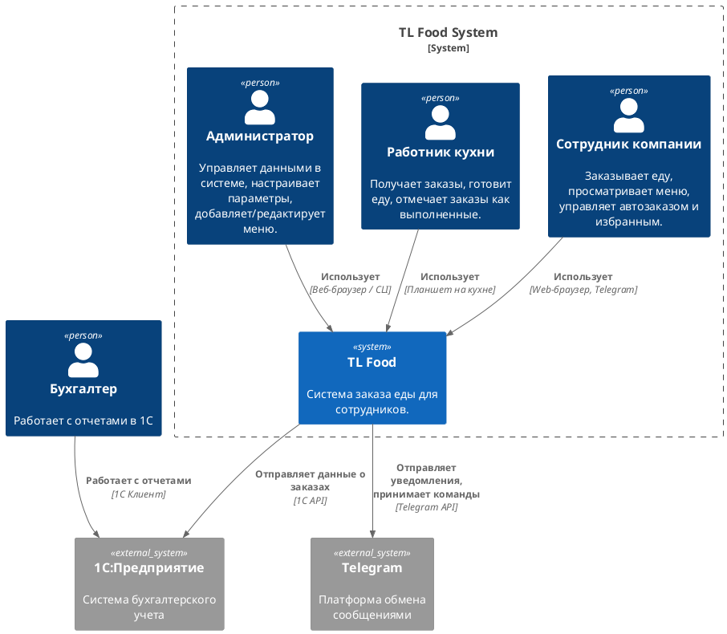

```plantuml
@startuml
!include <c4/C4_Context>

System_Boundary(c1, "TL Food System") {
    Person(user, "Сотрудник компании", "Заказывает еду, просматривает меню, управляет автозаказом и избранным.")
    Person(cook, "Работник кухни", "Получает заказы, готовит еду, отмечает заказы как выполненные.")
    Person(admin, "Администратор", "Управляет данными в системе, настраивает параметры, добавляет/редактирует меню.")
     System(tlfood, "TL Food", "Система заказа еды для сотрудников.")
}

Rel(user, tlfood, "Использует", "Web-браузер, Telegram")
Rel(cook, tlfood, "Использует", "Планшет на кухне")
Rel(admin, tlfood, "Использует", "Веб-браузер / CLI")

System_Ext(one_c, "1С:Предприятие", "Система бухгалтерского учета")

' Внешние системы
System_Ext(telegram, "Telegram", "Платформа обмена сообщениями")
Rel(tlfood, telegram, "Отправляет уведомления, принимает команды", "Telegram API")
Rel(tlfood, one_c, "Отправляет данные о заказах", "1С API")


Person(accountant, "Бухгалтер", "Работает с отчетами в 1С")
Rel(accountant, one_c, "Работает с отчетами", "1С Клиент")
@enduml
```
