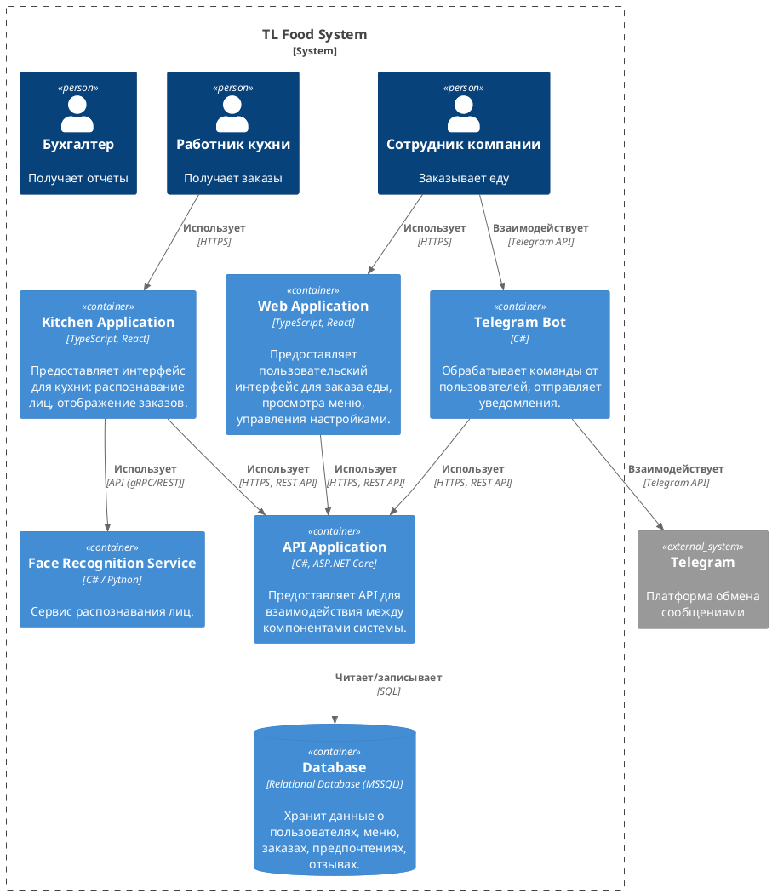

- **Контейнеры:**
    
    - **Web Application:** Фронтенд веб-приложения (React). Интерфейс для сотрудников.
    - **Kitchen Application:** Фронтенд приложения для кухни (React). Интерфейс для работников кухни с Face Recognition.
    - **API Application:** Бэкенд (ASP.NET Core). Предоставляет REST API для взаимодействия между фронтендом и базой данных, а также для взаимодействия с Telegram-ботом.
    - **Telegram Bot:** Обрабатывает команды от пользователей в Telegram и отправляет уведомления.
    - **Database:** База данных (MSSQL). Хранит всю информацию о пользователях, меню, заказах и т.д.
    - **Face Recognition Service:** Отдельный сервис, отвечающий за распознавание лиц. Может быть реализован на C# или Python (с использованием библиотек типа Dlib, OpenCV, Face++) и предоставлять API (gRPC или REST). Вынесение в отдельный сервис обеспечивает лучшую масштабируемость и позволяет использовать наиболее подходящие технологии для распознавания.
        
- **Взаимодействия:**
    - Пользователи взаимодействуют с Web Application через HTTPS.
    - Работники кухни взаимодействуют с Kitchen Application через HTTPS.
    - Все фронтенд-приложения (Web Application, Kitchen Application) взаимодействуют с API Application через REST API по HTTPS.
    - Telegram Bot взаимодействует с пользователями через Telegram API и с API Application через REST API.
    - API Application читает и записывает данные в Database с помощью SQL-запросов.
    - Kitchen Application взаимодействует с Face Recognition Service через API (gRPC или REST) для распознавания лиц.
    - Telegram Bot взаимодействует с Telegram через Telegram API

