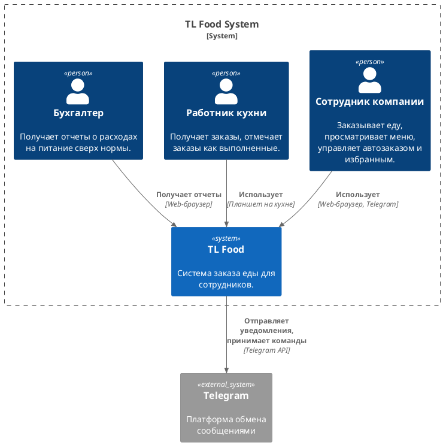

- **Пользователи (Люди):**
    
    - **Сотрудник компании:** Основной пользователь системы. Заказывает еду, просматривает меню, управляет своими предпочтениями.
        
    - **Работник кухни:** Использует систему для получения и обработки заказов.
        
    - **Бухгалтер:** Получает отчеты о расходах на питание.
        
- **Система (TL Food):** Основная система, которую мы разрабатываем.
    
- **Внешние системы:**
    
    - **Telegram:** Используется для отправки уведомлений пользователям (и, возможно, для приема заказов в будущем).
        
- **Взаимодействия:**
    
    - Сотрудники и Бухгалтер используют TL Food через веб-браузер.
        
    - Работники кухни используют TL Food через специальное приложение на планшете, установленном на кухне (включая Face Recognition).
        
    - TL Food взаимодействует с Telegram через Telegram API для отправки уведомлений.

