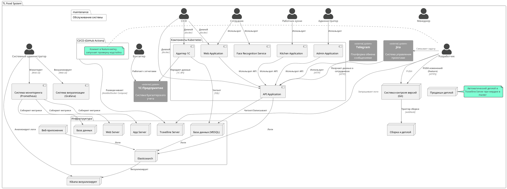

```plantuml
@startuml
!theme vibrant
!include <c4/C4_Component>

' Системный контекст
package "TL Food System" as system {

  actor "Разработчик" as dev
  actor "Менеджер" as pm
  actor "Системный администратор" as sys_admin
    actor "Сотрудник" as employee
  actor "Работник кухни" as cook
  actor "Администратор" as admin
  actor "Бухгалтер" as accountant
  node "Kibana визуализирует" as kibana
    node "Система контроля версий (Git)" as system_vcs << (C, #FFAAAA) >>
    node "Веб-приложение" as web_app

   node "Сборка и деплой" as deploy_action << (C, #FFAAAA) >>
     node "Продакшн деплой" as prod_deploy

      [Система мониторинга (Prometheus)] as prometheus << (C, #FFAAAA) >>
       [Система визуализации (Grafana)] as grafana << (C, #FFAAAA) >>

    ' Уровень приложений
  package "Компоненты Kubernetes" as kubernetes {
        [API Application] as api << (C, #FFAAAA) >>
        [Web Application] as webapp << (C, #FFAAAA) >>
        [Kitchen Application] as kitchenapp << (C, #FFAAAA) >>
          [Admin Application] as adminapp << (C, #FFAAAA) >>
        [Face Recognition Service] as face_rec << (C, #FFAAAA) >>
               [Адаптер 1С] as adapter << (C, #FFAAAA) >>
  }

' Внешние системы
  System_Ext(one_c, "1С:Предприятие", "Система бухгалтерского учета")
  System_Ext(telegram, "Telegram", "Платформа обмена сообщениями")
  System_Ext(jira, "Jira", "Система управления проектами")

  ' Инфраструктура
   package "Инфраструктура" as infrastructure {
             node "Travelline Server" as tl_server << (C, #FFAAAA) >>
     node "База данных (MSSQL)" as db << (C, #FFAAAA) >>
     node "Web Server" as web_server  << (C, #FFAAAA) >>
  node "App Server" as app_server  << (C, #FFAAAA) >>
               node "Elasticsearch" as elastic << (C, #FFAAAA) >>
         Rel(db, elastic, "Логи", "")
   Rel(web_app, elastic, "Логи", "")
    Rel(api, elastic, "Логи", "")
         Rel(prometheus, app_server, "Собирает метрики", "")
node "База данных" as db_server

Rel(prometheus, db_server, "Собирает метрики", "")
   Rel(prometheus, web_server, "Собирает метрики", "")
    Rel(elastic, kibana, "Визуализирует","")
}

  ' Связи приложений
  Rel(webapp, api, "Использует API")
  Rel(kitchenapp, api, "Использует API")
        Rel(adminapp, api, "Использует API")
    Rel(api, db, "Читает/Записывает")
 Rel(adapter, db, "Читает","SQL")
        Rel(adapter, one_c, "Передает данные", "1C API")

' Связь с пользователями
        Rel(employee, webapp, "Использует")
         Rel(employee, face_rec, "Использует","")
            Rel(cook, kitchenapp, "Использует")
        Rel(admin, adminapp, "Использует")
            Rel(accountant, one_c, "Работает с отчетами")

    Rel(telegram, api, "Использует","HTTP")
    Rel(jira, api, "Получает данные о сотрудниках","HTTP")

  ' Связи разработки
  package "CI/CD (GitHub Actions)" as cicd {

    note left of dev : Коммит в feature-ветку,\n запускает проверку кодстайла
   dev -> jira: Связывает задачу
dev -[hidden]-> prod_deploy
    dev -> system_vcs: PUSH

        dev -> tl_server: Запрашивает логи


  }


      Rel(dev, system_vcs, "PUSH изменений (feature)", "HTTPS")
       Rel(system_vcs, deploy_action, "Триггер сборки","webhook")


               note right of prod_deploy : Автоматический деплой в Travelline Server при мердже в master

   Rel(CICD, webapp, "Деплой","docker")
     Rel(CICD, api, "Деплой","docker")
    Rel(CICD, adapter, "Деплой","docker")
    Rel(cicd, tl_server, "Разворачивает", "Ansible/Docker Compose")

' Мониторинг
  package "Обслуживание системы" as maintenance {
         Rel(sys_admin, kibana, "Анализирует логи")


        Rel(sys_admin, prometheus, "Мониторит", "Web UI")
        Rel(sys_admin, grafana, "Визуализирует", "Web UI")
}

}

@enduml
```
