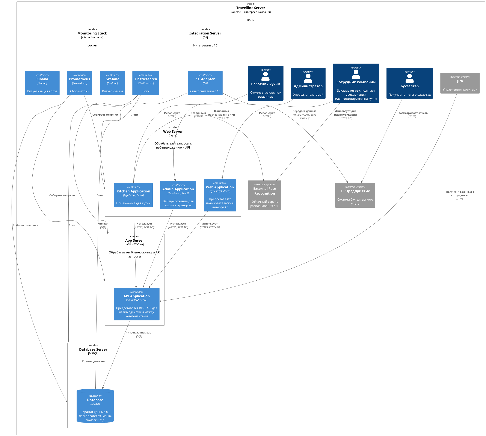

```plantuml
@startuml
!include <c4/C4_Deployment>

'Окружение
Deployment_Node(travelline_server, "Travelline Server", "Собственный сервер компании", "linux") {

  together {
    Person(employee, "Сотрудник компании", "Заказывает еду, получает уведомления, идентифицируется на кухне")
    Person(cook, "Работник кухни", "Отмечает заказы как выданные")
    Person(admin, "Администратор", "Управляет системой")
    Person(accountant, "Бухгалтер", "Получает отчеты о расходах")
    System_Ext(one_c, "1С:Предприятие", "Система бухгалтерского учета")
    System_Ext(jira, "Jira", "Управление проектами")
    System_Ext(face_recognition_external, "External Face Recognition", "Облачный сервис распознавания лиц")
  }

  ' Контейнеры
  Deployment_Node(web_server, "Web Server", "nginx", "Обрабатывает запросы к веб-приложению и API") {
    Container(web_app, "Web Application", "TypeScript, React", "Предоставляет пользовательский интерфейс")
    Container(kitchen_app, "Kitchen Application", "TypeScript, React", "Приложение для кухни")
     Container(admin_app, "Admin Application", "TypeScript, React", "Веб приложение для администраторов")
    Rel(employee, web_app, "Использует", "HTTPS")
    Rel(cook, kitchen_app, "Использует", "HTTPS")
    Rel(admin, admin_app, "Использует", "HTTPS")
    Rel(employee, face_recognition_external, "Использует для идентификации", "HTTPS, API")
  }

    Deployment_Node(app_server, "App Server", "ASP.NET Core", "Обрабатывает бизнес-логику и API запросы"){
        Container(api, "API Application", "C#, ASP.NET Core", "Предоставляет REST API для взаимодействия между компонентами")
           Rel(web_app, api, "Использует", "HTTPS, REST API")
            Rel(kitchen_app, api, "Использует", "HTTPS, REST API")
          Rel(admin_app, api, "Использует", "HTTPS, REST API")
            Rel(jira, api, "Получение данных о сотрудниках", "HTTPS")

    }

   Rel(kitchen_app, face_recognition_external, "Выполняет распознавание лиц", "HTTPS, API")

  Deployment_Node(db_server, "Database Server", "MSSQL", "Хранит данные") {
    ContainerDb(database, "Database", "MSSQL", "Хранит данные о пользователях, меню, заказах и т.д.")
          Rel(api, database, "Читает/записывает", "SQL")
  }


   Deployment_Node(integration_server, "Integration Server", "С#", "Интеграция с 1С"){
         Container(adapter_1c, "1C Adapter", "С#", "Синхронизация с 1C")
          Rel(adapter_1c, database, "Читает", "SQL")
         Rel(adapter_1c, one_c, "Передает данные", "1C API / COM / Web Services")
          Rel(accountant, one_c, "Просматривает отчеты", "1С UI")
    }

    Deployment_Node(monitoring, "Monitoring Stack", "k8s deployments", "docker"){
          Container(prometheus, "Prometheus", "Prometheus", "Сбор метрик")
            Container(grafana, "Grafana", "Grafana", "Визуализация")
              Container(elastic, "Elasticsearch", "Elasticsearch", "Логи")
               Container(kibana, "Kibana", "Kibana", "Визуализация логов")
             Rel(prometheus, app_server, "Собирает метрики", "")
              Rel(prometheus, db_server, "Собирает метрики", "")
             Rel(prometheus, web_server, "Собирает метрики", "")
                Rel(elastic, app_server, "Логи", "")
         Rel(elastic, db_server, "Логи", "")
         Rel(elastic, web_server, "Логи", "")

        }

}
@enduml
```
